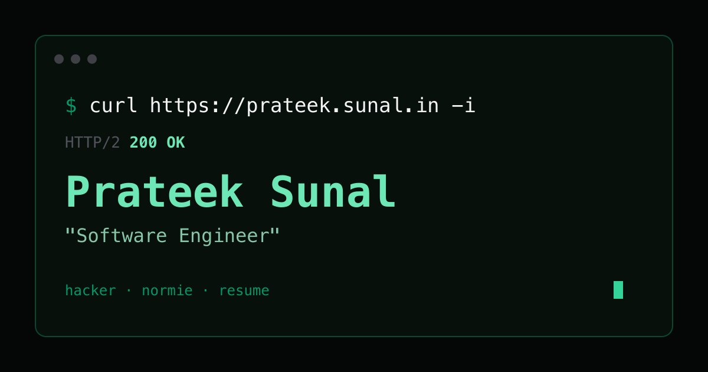

<p align="center">
  <a href="https://prateek.sunal.in"></a>
</p>

<h1 align="center">prateek.sunal.in</h1>

<p align="center"><b>One profile, three moods. A terminal for hackers, an editorial page for normies, and a résumé for recruiters.</b></p>

<p align="center">
  <a href="https://prateek.sunal.in"></a>
  <a href="https://prateek.sunal.in/blog/"></a>
  <a href="https://prateek.sunal.in/feed.xml"></a>
</p>

<p align="center">
  <a href="https://prateek.sunal.in"></a>
</p>

Prefer a real terminal? Run the same command the hacker view types:

```sh
curl https://prateek.sunal.in/api
```

You get an ASCII portrait and the profile as JSON. For JSON only, use `/api.json`.

#### Features

- [x] **Three views** — `hacker`, `normie`, and `resume`, all from one data source in `src/data/`
- [x] **Shareable modes** — the URL hash (`#resume`) picks the view, and the site remembers your last pick
- [x] **Accessible** — keyboard-navigable mode tabs, visible focus rings, reduced-motion support, and Esc/Enter to skip the intro
- [x] **Static blog** — markdown rendered to HTML at build time, so posts work without JavaScript
- [x] **Generated extras** — `/blog/` index, `feed.xml`, `sitemap.xml`, `llms.txt`, and `/api`, all built from the same data
- [x] **Zero servers** — plain GitHub Pages, deployed by GitHub Actions

## Run locally

```bash
git clone https://github.com/prateekmedia/prateekmedia.github.io.git
cd prateekmedia.github.io
npm install
npm run dev
```

Then open the URL Vite prints (usually `http://localhost:5173`). The dev server also serves the blog, the feed, and `/api`, using the same renderer as the build.

| Command | What it does |
| --- | --- |
| `npm run dev` | Start the dev server |
| `npm run lint` | Run oxlint |
| `npm run build` | Build the app into `dist/`, then render the blog and generated files |
| `npm run preview` | Serve the production build |

## Write a post

1. Create `public/blog/<slug>/<slug>.md` with frontmatter:

   ```md
   ---
   title: My Post
   date: October 2, 2026
   author: Prateek Sunal
   summary: One-line description for llms.txt
   ---
   ```

2. Copy another post's `index.html` into the folder and update its title and Open Graph tags. Add an `og.png` if you like.
3. Add the post to `profile.blogs` in `src/data/profile.js` so the three views link to it.

`scripts/blog.mjs` does the rest: it renders the post and updates the index, feed, sitemap, and `llms.txt`. Generated files only ever go to `dist/`, so none of them are committed.

## Deploy

Every push to `main` runs `.github/workflows/deploy.yml`, which lints, builds, and publishes `dist/` to GitHub Pages. The custom domain comes from `public/CNAME`.

For a fresh fork, set **Settings → Pages → Build and deployment → Source** to **GitHub Actions**.

The social preview image `public/og.png` is committed. To change it, edit `scripts/og.svg` and re-render it:

```sh
rsvg-convert -w 1200 -h 630 scripts/og.svg -o public/og.png
```

## Structure

```text
src/
  config/      mode list (views, titles, theme colours)
  data/        profile and résumé content: the single source of truth
  features/    hacker, editorial, and résumé views
  components/  shared UI (mode switcher, links)
  styles/      Tailwind theme and global styles
scripts/
  blog.mjs     build-time renderer for the blog, feed, sitemap, llms.txt, and /api
  og.svg       source for the social preview image
public/
  blog/        posts: markdown plus an HTML template each
```

If something looks off, **[open an issue](https://github.com/prateekmedia/prateekmedia.github.io/issues)**.
